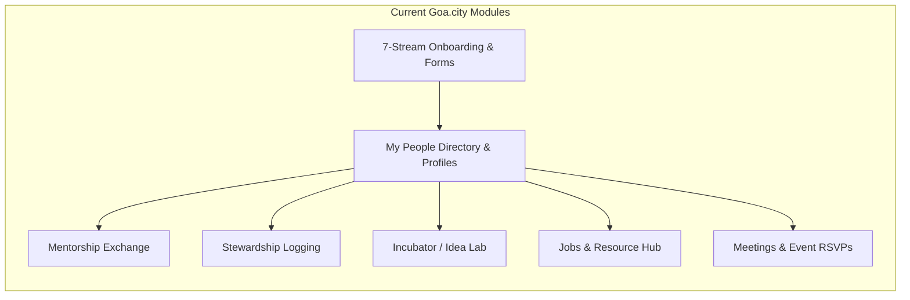
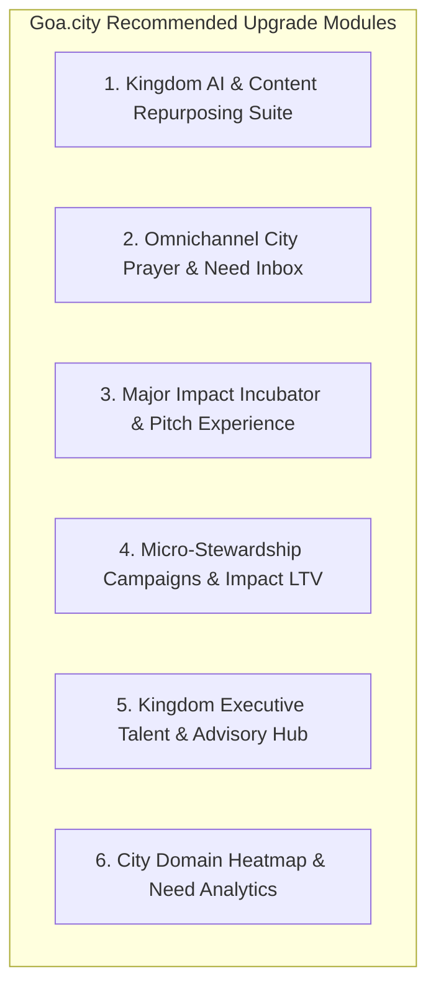
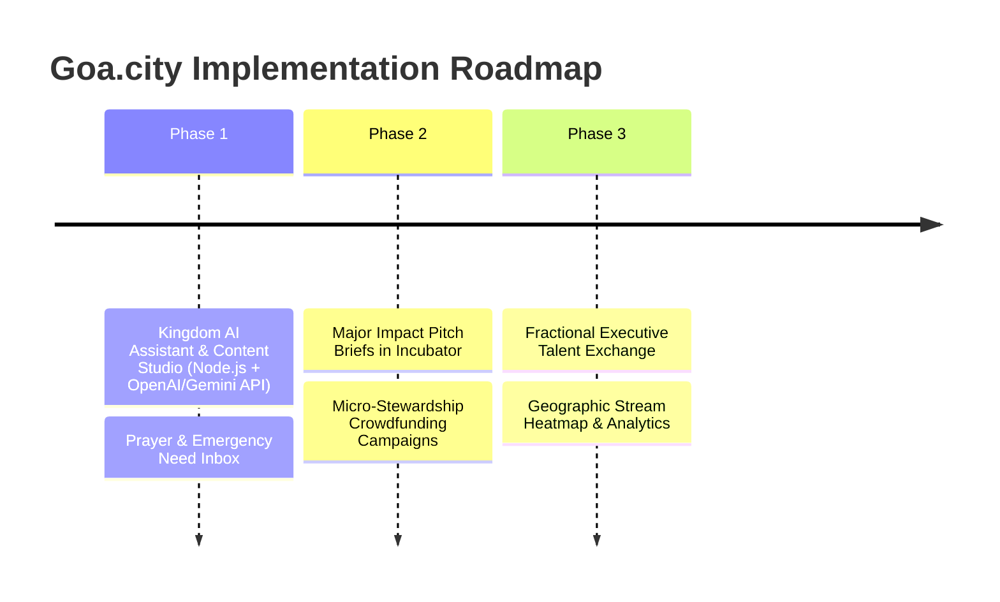

# Goa.City Strategic Research, Ecosystem Benchmarking & Module Roadmap

## Executive Summary

This report delivers a thorough research analysis of four leading faith-tech and kingdom-ecosystem entities:
1. **[Gloo](https://gloo.com/)** – Faith-tech platform and digital ecosystem builder.
2. **[Servant.io](https://www.servant.io/)** – Kingdom digital transformation, AI strategy, and product consultancy.
3. **[Westfall Gold](https://www.westfallgold.com/)** – Major donor experience design agency and capital campaign consultancy.
4. **[Masterworks Agency](https://www.masterworks.agency/)** – Direct-response marketing, digital donor acquisition, and branding agency.

Crucially, our research reveals that **Gloo sits at the apex of a consolidated ecosystem strategy**: Gloo acquired **Masterworks Agency** (mid-2025) and **Westfall Gold** (early 2026), and made a major strategic investment in **Servant.io** (2025). Together, they form an end-to-end stack spanning **Platform Technology + AI**, **Digital Transformation**, **Major Donor Capital Cultivation**, and **Digital Marketing/Fundraising**.

We have evaluated **[Goa.city](file:///Users/stevensdumpala/Imagefile/goa.city)**—our regional full-stack Kingdom Marketplace & City Transformation Platform—against this benchmark. While Goa.city excels at local 7-stream categorization, mentorship matching, project incubation, and stewardship logging, it can dramatically scale its kingdom impact by adopting key modular and technological innovations from the Gloo ecosystem.

---

## 1. Deep-Dive Research on the Target Entities

```mermaid
graph TD
    subgraph Gloo Ecosystem ("The Gloo Ecosystem Infrastructure")
        Gloo["Gloo.com (Platform, AI Studio & Workspace)"]
        Servant["Servant.io (Consultancy & Product Strategy)"]
        Westfall["Westfall Gold (Major Donor Experiences)"]
        Masterworks["Masterworks Agency (Marketing & Direct Response)"]
        
        Gloo -- Strategic Investment (2025) --> Servant
        Gloo -- Acquired (Jan 2026) --> Westfall
        Gloo -- Acquired (July 2025) --> Masterworks
    end
```

### A. Gloo (`https://gloo.com/`)
* **Core Function:** Technology platform providing software tools, AI infrastructure, and a B2B network dedicated to faith-based organizations, churches, and mission-driven builders.
* **Key Offerings:**
  * **Gloo Workspace:** All-in-one management hub featuring an omnichannel **Communications Suite** (SMS/Email broadcasts, automated keyword workflows like text-to-connect, and a centralized **Prayer Inbox**).
  * **Ministry Chat & Content Studio:** AI assistants integrated with Church Management Systems (ChMS) to handle administrative follow-ups and automatically turn sermon audio/video into devotionals, social clips, and small-group guides.
  * **Gloo Insights:** Demographic and spiritual posture analytics helping leaders understand local community needs.
  * **Gloo AI Studio & B2B Ecosystem:** Developer hub for values-aligned AI tools, backed by acquisitions and strategic venture investments.

### B. Servant.io (`https://www.servant.io/`)
* **Core Function:** Management, product design, and technology consultancy for kingdom organizations, churches, and Christian enterprises.
* **Key Offerings:**
  * **Digital Transformation & AI Strategy:** Custom product development, modern data architectures, and AI adoption tailored for ministries.
  * **Talent & Growth Advisory:** Placing high-caliber tech talent, advisors, and fractional leaders into kingdom initiatives.
  * **Ecosystem Role:** Acts as the hands-on advisory and implementation engine powered by Gloo's platform capabilities.

### C. Westfall Gold (`https://www.westfallgold.com/`)
* **Core Function:** Experience design agency and major donor fundraising consultancy (credited with raising over $2 Billion for major non-profits and ministries).
* **Key Offerings:**
  * **Major Donor Experiences:** High-end, multi-day immersive gatherings that compress 12 to 24 months of donor cultivation into a 3.5-day experience.
  * **Transformational Ask Strategy & Storytelling:** High-touch donor file audits, custom video production, scriptwriting, and strategic ask execution.
  * **Ecosystem Role:** Serves as the major capital engine, connecting high-net-worth philanthropists to kingdom initiatives.

### D. Masterworks Agency (`https://www.masterworks.agency/`)
* **Core Function:** Full-service direct-response marketing, digital donor acquisition, brand strategy, and media agency.
* **Key Offerings:**
  * **Omnichannel Digital Acquisition:** Paid digital marketing (Meta, TikTok, Google, Programmatic) paired with direct mail and email nurture sequences.
  * **Data & Analytics:** Predictive donor lifetime value (LTV) modeling and donor segmentation.
  * **Ecosystem Role:** Provides the scalable, mass-market donor acquisition engine that feeds recurring micro-donations into ministries.

---

## 2. Current Capabilities of Goa.city

Goa.city is built as a React 19 + Node.js/PostgreSQL platform tailored for the **Goa Transformation Network & Coalition**.



### Current Strengths of Goa.city:
1. **Stream-Based Organization:** Strong domain-based segmentation across the 7 Mountains/Streams (Business, Faith, Arts, Education, Governance, Media, Family).
2. **Dynamic Onboarding & Form Builder:** Flexible admin-driven form generation.
3. **Peer-to-Peer Mentorship Exchange:** End-to-end mentorship matching, workspace, goal tracking, and session logging.
4. **Verified Stewardship Ledger:** Financial and skills-based contribution logging with verification statuses.
5. **Incubator / Idea Lab:** Crowdsourcing and tracking city-transformation projects.
6. **Community Utility:** Integrated Job Board, Resource Library, and Event Management with payment support.

---

## 3. Comparative Benchmarking Matrix

| Feature / Dimension | **Gloo Consolidated Ecosystem** | **Goa.city (Current State)** | Strategic Opportunity for Goa.city |
| :--- | :--- | :--- | :--- |
| **Primary Scope** | Global B2B/B2C Faith Platform + Agency Network | Regional/City Transformation Marketplace | Deepen regional hyper-locality while expanding tools |
| **AI Integration** | Advanced (Ministry Chat, Content Studio, Gloo AI Studio) | None (Static form processing & basic REST flows) | Add embedded Kingdom AI Assistant & Content Synthesizer |
| **Messaging & Engagement** | SMS, Automated Workflows, Centralized Prayer Inbox | Basic Email (Resend) + Basic WhatsApp hooks | Build unified Prayer/Need Inbox & WhatsApp Workflows |
| **Capital & Funding** | Major Donor Events (Westfall) + Digital Direct Marketing (Masterworks) | Basic Stewardship Logging (Self-reported gifts & hours) | Add Impact Pitch Decks, Campaign Crowdfunding & Major Donor Modules |
| **Talent & Advisory** | Talent placement & digital transformation strategy (Servant.io) | Peer Mentorship Exchange & Basic Job Board | Create Executive/Fractional Talent Exchange & Digital Playbooks |
| **Data & Insights** | Community demographic heatmaps & spiritual posture data | Admin system stats (counts, pending lists) | Build Geographic Stream Heatmap & City Need Analytics |

---

## 4. Proposed Modules & Improvements for Goa.city

Based on our benchmarking against Gloo, Servant.io, Westfall Gold, and Masterworks, we recommend implementing **6 major upgrade modules** for Goa.city:



### Module 1: Kingdom AI & Content Repurposing Suite *(Inspired by Gloo AI & Content Studio)*
* **City Assistant ("Goa Kingdom AI"):** An embedded AI assistant in the Member Portal that helps users match with mentors, discover relevant Incubator projects, find job opportunities, and locate stream resources using natural language.
* **Stream Content Repurposer:** Allows stream leaders, pastors, and speakers to upload audio/video recordings or transcripts from network meetings, automatically generating:
  * Short-form summaries for the News Feed.
  * Practical action points per domain stream.
  * Discussion guides for stream small groups.

### Module 2: Omnichannel City Prayer & Need Inbox *(Inspired by Gloo Communications)*
* **Unified City Prayer & Emergency Need Portal:** A private request inbox where members can submit prayer requests or practical needs (e.g. disaster relief, family assistance, legal/business counsel).
* **Smart Routing & Intercessor Tags:** Requests are automatically tagged by stream (e.g., Business, Governance) and routed to verified stream intercessors or volunteers.
* **Automated WhatsApp Sequences:** Trigger automated follow-ups via WhatsApp when a user opts into a specific stream or RSVPs to a major meeting.

### Module 3: Major Impact Incubator & Pitch Experience *(Inspired by Westfall Gold)*
* **High-Impact Project Briefs:** Upgrade the **Incubator / Idea Lab** so high-potential project founders can generate structured "Kingdom Impact Briefs" (combining financial forecasts, spiritual impact metrics, and video intros).
* **Major Donor Gathering / Pitch Days:** Create an event sub-module within `Meetings` designed for high-net-worth kingdom stewards in Goa, featuring curated project presentations, compressed donor commitments, and formal pledge tracking.

### Module 4: Micro-Stewardship Campaigns & Impact LTV Analytics *(Inspired by Masterworks Agency)*
* **Direct Campaign Crowdfunding:** Expand `Stewardship` from passive historical logging into active campaign support (e.g. funding a specific community school, disaster response, or incubator project).
* **Steward Lifetime Impact Dashboard (LTV):** A rich visual dashboard for members showing their cumulative kingdom legacy: total funds contributed, total skill hours given, mentees developed, and jobs generated through their network involvement.

### Module 5: Kingdom Executive Talent & Advisory Network *(Inspired by Servant.io)*
* **Fractional Talent Exchange:** Expand the `Jobs` and `Mentorship` modules to support high-tier fractional advisory (e.g. fractional CFOs, legal advisors, tech architects, marketing strategists) who want to dedicate 2–5 hours/week to accelerating local Christian enterprises and non-profits in Goa.
* **Digital Transformation Playbooks:** A curated hub within `Resources` providing step-by-step guides for local churches and businesses on adopting AI, modernizing accounting, and scaling operations.

### Module 6: City Domain Heatmap & Intelligence Dashboard *(Inspired by Gloo Insights)*
* **Goa Geographic & Stream Heatmap:** An interactive GIS/map view in the Admin Console (and high-level in Member Dashboard) mapping active members, businesses, incubator initiatives, and community needs across Goa's talukas (Panaji, Margao, Mapusa, Vasco, Ponda, etc.).
* **Stream Health Scorecard:** Analytics measuring stream engagement, mentor-to-mentee ratios, job fulfillment rates, and project funding completeness.

---

## 5. Architectural Roadmap & Next Steps



1. **Phase 1 (Immediate - High ROI):**
   - Implement the **Kingdom AI Assistant** and **Content Repurposer** in frontend/backend.
   - Build the **Unified Prayer & Need Inbox** into the dashboard and WhatsApp service.
2. **Phase 2 (Medium Term):**
   - Enhance **Incubator / Idea Lab** with Major Impact Pitch Briefs and compressed pitch event management.
   - Add **Micro-Stewardship Crowdfunding** and individual **Kingdom Legacy LTV Dashboards**.
3. **Phase 3 (Long Term Expansion):**
   - Deploy **Kingdom Fractional Talent Exchange**.
   - Integrate **Goa Geographic Stream Heatmap** into the Admin Analytics console.

---
*Report generated for Goa.city Strategy & Technical Architecture.*
