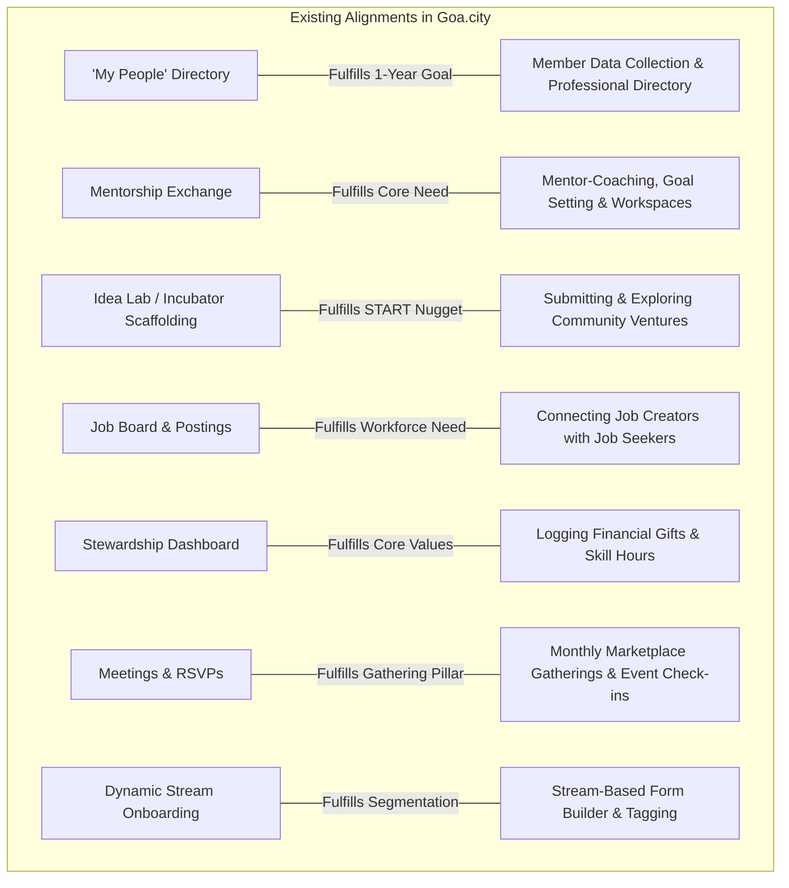
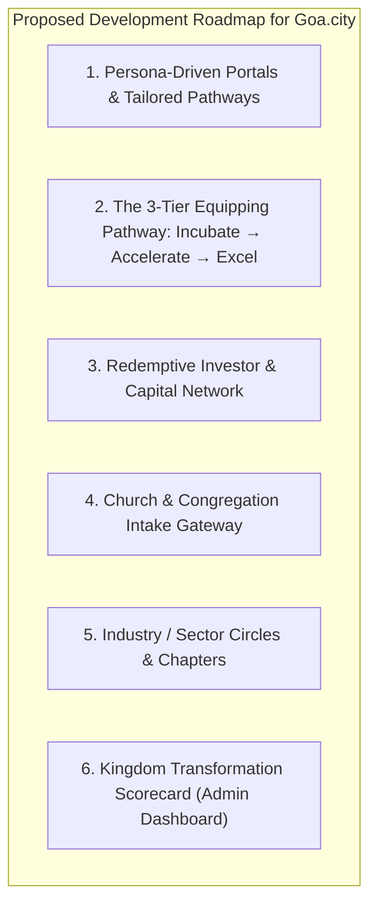
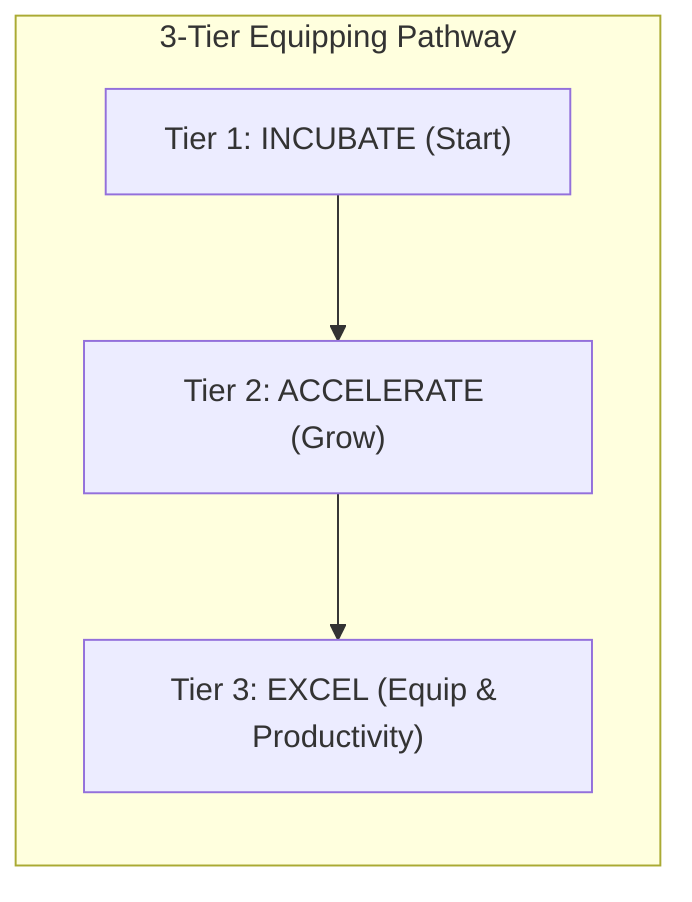
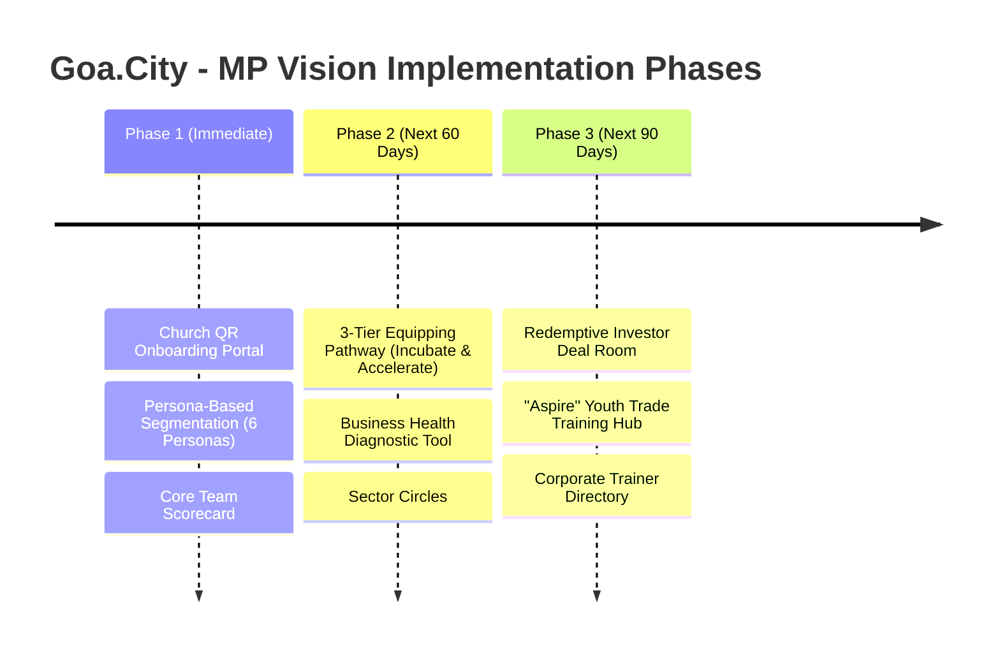

# MP Vision Document Review & Goa.City Alignment & Development Plan

## 1. Executive Summary

A comprehensive review of **`MP Vision.docx`** (from the Marketplace Core Team meeting) reveals a deeply formational, relational, and missional strategy for city-wide transformation in Goa. 

The core identity of the movement is:
> **"A Kingdom movement, not an organisation."**  
> Unconcerned with organizational credit, focused on personal renewal leading to workplace transformation and ultimately a flourishing Goa.

### The Theory of Change (TOC) Pathway
$$\text{Renewal} \longrightarrow \text{Community} \longrightarrow \text{Equipping} \longrightarrow \text{Collaboration} \longrightarrow \text{Transformation}$$

---

## 2. Core Team Roles & Operational Structure
The document outlines specific leaders responsible for key pillars, which directly informs platform access levels and feature ownership:

| Pillar | Core Team Leaders | Corresponding Goa.City Platform Area |
| :--- | :--- | :--- |
| **Church & Pastor Relations** | John, Stevens | Church Gateway, Parish Intake QR & Congregational Onboarding |
| **Membership, Member Care & Community** | Pradeep, Jason | "My People" Directory, Member Profiles, Community Care & Support Groups |
| **Monthly Gatherings** | Atasha, Fiona | Meetings, Gatherings, Ticketing, Breakout Group (BOR) Prompts |
| **Industry / Sector Engagement** | Jason, John, Caesar | Sector Circles (Hospitality, Manufacturing, Real Estate, Trades) |
| **Training & Equipping** | Pradeep, Chef Prasad | Training Hub, Corporate Trainer Pool, Trade Upskilling |
| **Partnerships & Collaboration** | Sunita, Fiona | External Collaborations, City Initiatives, Cross-Community Alliances |
| **Monthly Communications** | Sunita, Stevens | News Feed, WhatsApp Broadcasts, Community Announcements |
| **Mentoring** | Caesar, Chef Prasad | Mentorship Exchange, Business Coaching & Accelerator Tracking |

---

## 3. What Already Aligns with Goa.city

Goa.city has already implemented several foundational modules that directly address the vision:

---

## 4. Key Gaps & What We Can Develop in Goa.city

Based on the explicit needs, target personas, and 1-to-10 year milestones in `MP Vision.docx`, here are the key features and modules we can develop:

---

### Module 1: Persona-Driven Portals & Tailored Pathways
The document identifies **6 distinct personas** with specific gaps between their "Current State" and "Renewed State":

| Persona | Current Pain Point | Renewed State | Platform Capability to Develop |
| :--- | :--- | :--- | :--- |
| **Entrepreneurs** | Focus on profit only; cashflow ignorance; lack of mentorship | Culture-shaping redemptive businesses; job creators | Business Health Assessment, Mentorship pairing, Pitch deck builder |
| **Professionals** | Slavery mindset; salary-centric; sacred-secular divide | Spirit of excellence; service-centric; marketplace ambassadors | Ethics in the Workplace guides, peer support circles |
| **Investors** | Quick returns; risk-averse; NPAs | Absorbing cost; patient redemptive capital; social & kingdom ROI | Redemptive Investor Portal with vetted venture deals |
| **Employees** | Toxic work culture; underpaid; crab mentality; burnout | Empowered; work-life balance; sense of ownership | Workplace wellness resources, peer encouragement channels |
| **Unemployed & Youth ("Aspire")** | Aimlessness; instant gratification; education-job mismatch | Trades training, vision, discipline, deferred gratification | "Aspire" Youth Trade Training hub (contractors, masons, hospitality) |
| **Civil Servants / Governance** | Systemic corruption; bribery; entitlement | Servant posture; God-fearing; punctual; systemic excellence | Confidential Civil Service Fellowship & ethical support group |

---

### Module 2: The 3-Tier Equipping Pathway (Incubate $\rightarrow$ Accelerate $\rightarrow$ Excel)
The vision outlines three distinct nuggets for marketplace capacity:

1. **Incubator (Start):**
   - Cohort-based application system (inspired by Praxis / JoyCorps / Bryan's "incubator of incubators").
   - Redemptive Business Model Canvas builder.
   - Milestone checklist for launch.
2. **Accelerator (Grow):**
   - Specifically tracks the document's revenue milestones:
     - New businesses $< \text{₹}10\text{ Lakhs}$
     - Scaling businesses $\text{₹}10\text{--}50\text{ Lakhs}$
     - High-growth businesses $> \text{₹}50\text{ Lakhs}$
   - Automated **Business Diagnostic Assessment Tool** (evaluating cashflow, hiring, legal compliance, and governance).
3. **Excel / Productivity / AI:**
   - AI & modern productivity workshops and micro-courses.
   - Corporate Trainer Pool directory to build institutional capacity.

---

### Module 3: Redemptive Investor & Capital Network
The document stresses: *"Absorbing the cost, thinking in terms of social return, build redemptive businesses, linking investors with good entrepreneurs."*

* **Investor Deck Hub:** Founders can upload vetted business plans, financial projections, and social/kingdom impact metrics.
* **Redemptive Deal Room:** An invite-only section for angel investors and business leaders to review opportunities, pledge capital, and offer executive mentorship.

---

### Module 4: Church & Pastor Relations Bridge (John & Stevens' Role)
The document specifies: *"15 min presentation in each church... Collect data of employees, businesses, unemployed, aspiring entrepreneurs."*

* **Parish / Church Landing Pages & QR Intake:**
  - Generate church-specific QR codes (e.g. `goa.city/church/st-inigo` or `goa.city/church/grace-fellowship`).
  - Allows attendees to instantly onboard during or after the 15-minute presentation, automatically tagging their home church while categorizing them into one of the 6 personas.

---

### Module 5: Industry / Sector Circles & Regional Chapters
The document highlights sector-specific needs:
* **Hospitality:** Hygiene, sanitation, true biblical hospitality vs. mere food service.
* **Manufacturing & Construction:** Safety compliances, toxic waste disposal, dignity for laborers (masons, painters).
* **Travel & Tourism / Real Estate / Medical / Education.**

**Platform Enhancement:**
* **Sector Circles:** Sub-communities within Goa.city where members can join their specific industry circle for peer roundtables, ethical standards discussion, and joint bidding/initiatives.
* **Regional Chapters:** Filtering and meetups segmented by North Goa and South Goa.

---

### Module 6: Kingdom Transformation Scorecard (Core Team Command Center)
A dedicated administrative dashboard for the Core Team to measure the **1-Year, 5-Year, and 10-Year Goals**:

* **Target Metrics Tracker:**
  * Member Target: $500\text{--}1,000$ members.
  * Startups Launched: Count of $<10\text{L}$, $10\text{--}50\text{L}$, and $>50\text{L}$ enterprises.
  * Mentorship Health: Active mentor-mentee pairs and completed coaching milestones.
  * Trade Upskilling: Youth enrolled in the "Aspire" trades initiative.
  * Business Turnarounds: Existing businesses showing revenue growth post-coaching.

---

## 5. Phased Implementation Plan

